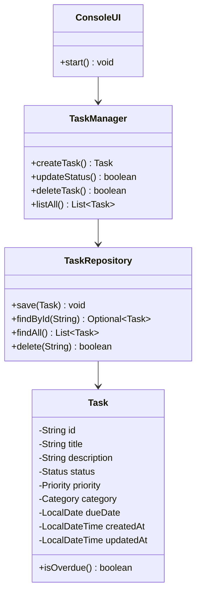

# Task Manager
Sistema de gestión de tareas desarrollado en Java con Programación Orientada a Objetos (POO).
Proyecto progresivo: comenzó como programa de consola y evolucionara a aplicación web con Spring Boot + React.


## Estado del proyecto

| Nivel | Estado | Descripción |
|-------|--------|-------------|
| **Nivel 1** | ✅ Completado | Java POO + Consola + Persistencia CSV |
| **Nivel 2** | ⏳ Pendiente | Spring Boot + REST API + PostgreSQL |
| **Nivel 3** | ⏳ Pendiente | Frontend React + Integración Full Stack |
| **Nivel 4** | ⏳ Pendiente | Testing avanzado + CI/CD (GitHub Actions) |

## Nivel 1 — Java POO

### Stack

| Tecnología | Versión |
|------------|---------|
| Java | 21 LTS |
| Maven | 3 |
| Persistencia | CSV (archivo local) |

### Funcionalidades

- CRUD completo: crear, listar, buscar, actualizar estado, eliminar tareas
- Filtros por estado, prioridad y categoría
- Detección automática de tareas vencidas
- Estadísticas por estado
- Persistencia en archivo CSV (los datos no se pierden al cerrar)
- Menú interactivo por consola

### Diagrama de clases


### Cómo ejecutar

```bash
# Compilar
mvn clean compile

# Ejecutar
mvn exec:java -Dexec.mainClass="com.taskmanager.Main"

# O desde IntelliJ: abrir el proyecto y ejecutar Main.main()
```


### Estructura del proyecto

task-manager/ 
├── pom.xml 
├── README.md 
├── src/main/java/com/taskmanager/ 
│ ├── Main.java 
│ ├── model/ 
│ │ ├── Status.java 
│ │ ├── Priority.java 
│ │ ├── Category.java 
│ │ └── Task.java 
│ ├── repository/ 
│ │ └── TaskRepository.java 
│ ├── service/ 
│ │ └── TaskManager.java 
│ └── ui/ 
│ └── ConsoleUI.java 
└── data/ 
  └── tasks.csv (se genera al ejecutar)

### Licencia

MIT — uso libre, modificación y distribución permitidas.
